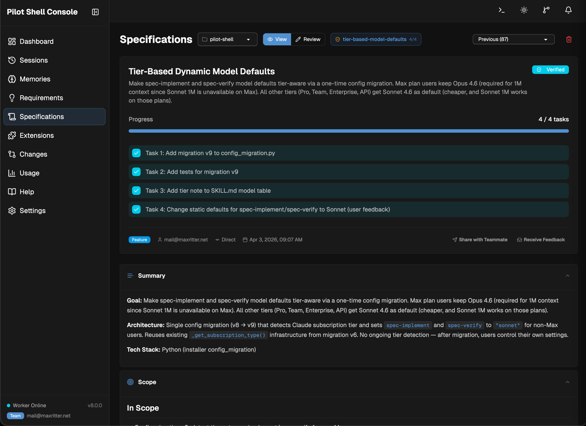
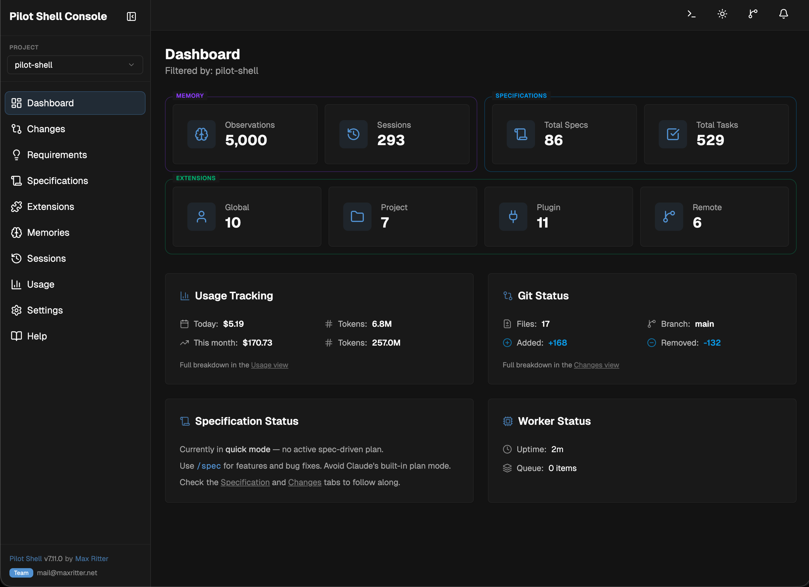
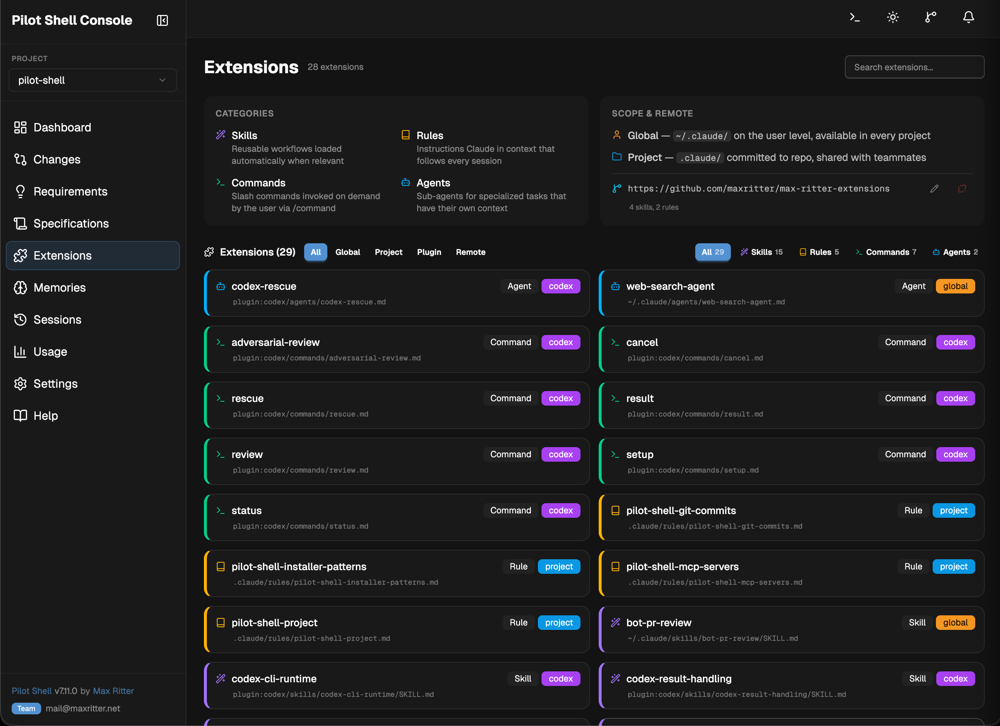

<div align="center">


### Make Claude Code production-ready.

From requirement to production-grade code — planned, tested, verified.</br>
**Spec-driven plans. Enforced quality gates. Persistent knowledge.**

[](https://github.com/maxritter/pilot-shell/stargazers)
[](https://star-history.com/#maxritter/pilot-shell&Date)
[](https://github.com/maxritter/pilot-shell/releases)
[](https://github.com/maxritter/pilot-shell/pulls)

<p>
  <a href="#install">Install</a> •
  <a href="#features">Features</a> •
  <a href="#pilot-shell-console">Console</a> •
  <a href="https://pilot-shell.com/docs">Docs</a> •
  <a href="https://pilot-shell.com">Website</a> •
  <a href="https://pilot.openchangelog.com/">Changelog</a>
</p>

```bash
curl -fsSL https://raw.githubusercontent.com/maxritter/pilot-shell/main/install.sh | bash
```

**macOS · Linux · Windows (WSL2)** — installs in under 2 minutes.

<br>


</div>

---

---

## Why Pilot Shell

**Claude Code writes code fast** — but without structure, it skips tests, loses context, and produces inconsistent results. Other frameworks add complexity (dozens of agents, thousands of lines of config) without meaningfully better output.

**Pilot Shell is different.** Every component solves a real problem:

- **`/spec`** — plans, implements, and verifies features end-to-end with TDD
- **`/prd`** — turns vague ideas into clear requirements with optional deep research
- **Quality hooks** — enforce linting, formatting, type checking, and tests as gates (not suggestions)
- **Context engineering** — preserves decisions and knowledge across sessions
- **Code intelligence** — semantic search (Probe) + code knowledge graph (CodeGraph)
- **Token optimization** — 60–90% cost reduction via RTK and context-mode
- **Extensions** — reusable rules, skills, and MCP servers with team sharing
- **Console** — local web dashboard with real-time notifications and session management
- **Pilot Bot** — persistent automation agent with scheduled tasks and background jobs

Run `pilot` for Spec-Driven Development with `/spec`, or `pilot bot` for 24/7 automations.

---

<h2 id="install">Getting Started</h2>

### Prerequisites

**Claude Code:** Install [Claude Code](https://code.claude.com/docs/en/quickstart) using the **native installer** before setting up Pilot Shell. If you have the `npm` or `brew` version installed, uninstall it first. If no Claude Code installation is detected, the Pilot installer will attempt to set it up for you.

**Claude Subscription:** Solo developers should choose [Max 5x](https://claude.com/pricing) for moderate usage or [Max 20x](https://claude.com/pricing) for heavy usage. Teams should use [Team Premium](https://claude.com/pricing) (6.25x usage per member, SSO, admin tools, billing management). Companies with stricter compliance or procurement requirements should use [Enterprise](https://claude.com/pricing) (API based pricing applies per usage).

**Terminal (Recommended):** [cmux](https://cmux.com) works great with Pilot Shell — its vertical tab layout lets you run multiple sessions side by side. Any modern terminal works: [Ghostty](https://ghostty.org/), [iTerm2](https://iterm2.com/), or the built-in macOS/Linux terminal.

**Claude Chrome (Recommended):** Install the [Claude Code Chrome extension](https://code.claude.com/docs/en/chrome) for browser automation and E2E testing. Pilot automatically detects it and uses it as the preferred tool. When Chrome isn't available, Pilot falls back to [playwright-cli](https://github.com/microsoft/playwright-cli) (reliable element targeting, persistent sessions, tracing) or [agent-browser](https://agent-browser.dev/) (lightweight, fast startup).

**Codex Plugin (Included):** The [Codex plugin](https://github.com/openai/codex-plugin-cc) is installed automatically with Pilot. It provides adversarial code review powered by OpenAI Codex — an independent second opinion during `/spec` planning and verification. Run `/codex:setup` once to authenticate, then enable reviewers in Console Settings → Reviewers. A [ChatGPT Plus](https://chatgpt.com/#pricing) subscription ($20/mo) covers the Codex API usage.

### Installation

**Works with any existing project.** Pilot Shell is installed on top of Claude Code and uses its built-in concepts like commands, rules, hooks, skills, subagents, MCP, LSP and optimized settings to improve your experience:

```bash
curl -fsSL https://raw.githubusercontent.com/maxritter/pilot-shell/main/install.sh | bash
```

Installs globally on macOS, Linux, and Windows (WSL2). All tools and rules go to `~/.pilot/` and `~/.claude/`. After installation, `cd` into any project and run `pilot` or `ccp` to start.

<details>
<summary><b>Downgrade</b></summary>

If you encounter an issue or unfixed bug in the latest version, you can always go back to a previous version (see [releases](https://github.com/maxritter/pilot-shell/releases)):

```bash
export VERSION=8.0.7
curl -fsSL https://raw.githubusercontent.com/maxritter/pilot-shell/main/install.sh | bash
```
</details>

<details>
<summary><b>Uninstalling</b></summary>

Removes the Pilot binary, plugin files, managed commands/rules, settings and shell aliases:

```bash
curl -fsSL https://raw.githubusercontent.com/maxritter/pilot-shell/main/uninstall.sh | bash
```
</details>

<details>
<summary><b>Using a Dev Container</b></summary>

Pilot Shell works inside Dev Containers. Copy the [`.devcontainer`](https://github.com/maxritter/pilot-shell/tree/main/.devcontainer) folder from this repository into your project, adapt it to your needs (base image, extensions, dependencies), and run the installer inside the container. The installer auto-detects the container environment and skips system-level dependencies like Homebrew.

</details>

<details>
<summary><b>What the installer does</b></summary>

7-step installer with progress tracking, rollback on failure, and idempotent re-runs:

1. **Prerequisites** — Checks/installs Homebrew, Node.js, Python 3.12+, uv, git, jq
2. **Claude files** — Sets up `~/.claude/` plugin — rules, commands, hooks, MCP servers
3. **Config files** — Creates `.nvmrc` and project config
4. **Dependencies** — Installs Probe, RTK, CodeGraph, context-mode (better-sqlite3), [playwright-cli](https://github.com/microsoft/playwright-cli), [agent-browser](https://agent-browser.dev/), language servers
5. **Shell integration** — Auto-configures bash, fish, and zsh with `pilot` alias
6. **VS Code extensions** — Installs recommended extensions for your stack
7. **Finalize** — Success message with next steps

</details>

---

<h2 id="features">How It Works</h2>

```bash
export VERSION=8.0.7
curl -fsSL https://raw.githubusercontent.com/maxritter/pilot-shell/main/install.sh | bash
```

Just chat — no plan, no approval gate. Quality hooks and TDD enforcement still apply. Best for small tasks and exploration. For anything that needs a plan, use `/spec` — not Claude Code's built-in plan mode.

### /spec — Spec-Driven Development

**`/spec` replaces Claude Code's built-in plan mode** (Shift+Tab). It provides a complete planning workflow with TDD, verification, and code review — use `/spec` instead of plan mode for all planned work.

Features, bug fixes, refactoring — describe it and `/spec` handles the rest. Auto-detects whether it's a feature or a bugfix and adapts the workflow. Specs are saved to `docs/plans/` and visible in the Console's **Specification** tab.

```bash
pilot
> /spec "Add user authentication with OAuth and JWT tokens"   # → feature mode
> /spec "Fix the crash when deleting nodes with two children"  # → bugfix mode (auto-detected)
```

```
Discuss  →  Plan  →  Approve  →  Implement (TDD)  →  Verify  →  Done
                                                        ↑         ↓
                                                        └── Loop──┘
```



<details>
<summary><b>Feature Mode</b></summary>

Full exploration workflow for new functionality, refactoring, or architectural changes.

**Plan:** Explores codebase with semantic search → asks clarifying questions → writes detailed spec with scope, tasks, and definition of done → for UI features, writes **E2E test scenarios** (step-by-step, browser-executable) that become the verification contract → **spec-review sub-agent** validates completeness → waits for your approval. Optional **Codex adversarial review** provides an independent second opinion when enabled.

**Implement:** Creates an isolated git worktree → implements each task with strict TDD (RED → GREEN → REFACTOR) → quality hooks auto-lint, format, and type-check every edit → full test suite after each task.

**Verify:** Full test suite + actual program execution → **unified review sub-agent** (compliance + quality + goal) → for UI features, executes each E2E scenario step-by-step via browser automation (pass/fail tracked, results written to plan) → auto-fixes findings → squash merges to main on success.

</details>

<details>
<summary><b>Bugfix Mode</b></summary>

Investigation-first workflow for targeted fixes. Finds the root cause before touching any code.

**Investigate:** Reproduces the bug → traces backward through the call chain to find the **root cause** at a specific `file:line` → compares against working code patterns → states the fix with confidence level. If 3+ hypotheses fail, escalates as an architectural problem.

**Test-Before-Fix:** Writes a regression test that FAILS on current code → implements the minimal fix at the root cause → verifies all tests pass. Defense-in-depth validation at multiple layers when the bug involves data flowing through shared code paths.

**Verify:** Lightweight verification — regression test confirmation → full test suite → lint + type check → quality checks. No review sub-agents — the regression test proves the fix works, the full suite proves nothing else broke.

**Why this matters:** Root cause investigation prevents "fix one thing, break another." The regression test locks in the fix. No formal notation overhead — just trace, test, fix, verify.

</details>

### Status Line

Pilot shell ships with its own advanced status line with real-time session metrics and spec progress:


<details>
<summary><b>All fields explained</b></summary>

**Line 1 — Session Metrics** (separated by `|`):

| Widget            | Description                                                                     |
| ----------------- | ------------------------------------------------------------------------------- |
| **Model**         | Active model in short form (`Opus 4.6 [1M]`, `Sonnet 4.6`)                      |
| **Context**       | Effective context usage with progress bar, buffer indicator, and token count. Green < 80%, Yellow 80–95%, Red 95%+ |
| **Lines changed** | `+added -removed` in session (hidden when usage API data available)             |
| **Git**           | Branch with staged (`+N`) / unstaged (`~N`) counts                              |
| **Cost**          | Session cost in USD. Green < $1, Yellow $1–5, Red $5+                           |           |
| **Savings**       | Token savings percentage from RTK proxy (`Savings: N%`), shown when no usage data |

**Line 2 — Mode:**

- **Quick Mode:** `Quick Mode`
- **Spec Mode:** Plan name, type (`feature`/`bugfix`), phase (`plan`/`implement`/`verify`), progress bar, task count, and iteration count

**Line 3 — Version & Session Info:**

`Pilot <version> (<tier>) · CC <version> (<subscription>) · sessions <N> · memories <N>`

Pilot tier: Solo, Team, or Trial with time remaining. Claude subscription (Pro/Max/Team/Enterprise) detected via `claude auth status` and cached for 24 hours.

</details>

### Pilot Shell Console

A local web dashboard with different views and real-time notifications when Claude needs your input:



<details>
<summary><b>All views</b></summary>

Each view with project-specific data has an inline **Project Filter** dropdown — switch projects without leaving the page. Dashboard stats tiles are clickable — navigate directly to the relevant view.

| View              | What it shows                                                                                                                                |
| ----------------- | -------------------------------------------------------------------------------------------------------------------------------------------- |
| **Dashboard**     | Global command center — 8 clickable stat cards, 4 recent cards (Specifications, Requirements, Sessions, Memories) with "Show all" links. Active specs as pills in the top bar, notification bell in top right. |
| **Sessions**      | Browse past sessions with search. Copy the session ID and use `/resume <session-id>` in Claude Code to jump back into any session.           |
| **Memories**      | Browsable observations — decisions, discoveries, bugfixes — with type filters and search. Each memory shows its session — click to navigate. |
| **Requirements**  | PRD documents with view/annotate modes. Selected shown as a tab, others in a Previous dropdown.                                             |
| **Specifications** | All spec plans with task progress, phase tracking, and iteration history. **Annotate mode** lets you mark up plans visually before approving — select text or click **+** on any block to write a note. **Share with Teammate** generates a compressed share link; **Receive Feedback** imports their annotations with accept/reject controls |
| **Extensions**    | All extensions — local, plugin, and remote — with team sharing via git, diff view, push/pull, and color-coded categories.                    |
| **Changes**       | Git diff viewer with staged/unstaged files, branch info, and worktree context. **Review mode** adds inline annotations on diff lines — the agent reads them directly before marking a spec as verified |
| **Usage**         | Daily token costs, model routing breakdown, and usage trends                                                                                 |
| **Help**          | Documentation, guides, and quick-start resources                                                                                             |
| **Settings**      | Model selection per command/sub-agent, spec workflow toggles (worktree, questions, approval), reviewer toggles (spec review, changes review, optional Codex), extended context (1M) toggle with pricing info |

</details>

<details>
<summary><b>Visual plan annotation</b></summary>

When a spec plan is pending approval, the Specifications tab defaults to **Annotate mode**. Two ways to annotate:

- **Select text** — highlight any passage and write a note via the floating toolbar
- **Click +** — hover over any block to add a note without selecting text

Annotations save automatically. The agent reads them at the next checkpoint, revises the plan accordingly, and asks for approval again. This turns plan review into a conversation — you mark what needs changing, the agent addresses it, you review again.

</details>

<details>
<summary><b>Spec sharing</b></summary>

Share specs and requirements with teammates for async review — no cloud service required:

1. **Share** — Click **Share with Teammate** to generate a compressed link. The entire spec and annotations are encoded into the URL fragment, so no data is transmitted to any server.
2. **Review** — Your colleague opens the link in their Console (or on pilot-shell.com), sees your annotations, and adds their own feedback.
3. **Import** — Click **Receive Feedback** to import their annotations. Each annotation has per-item **accept/reject** controls — accepted annotations merge into your plan, rejected ones are removed from both the sidebar and inline markers.

Everything works locally. The link is self-contained — the recipient doesn't need access to your machine, repository, or any shared service.

</details>

<details>
<summary><b>Code review</b></summary>

After a spec completes all automated checks, the agent prompts you to review the changes in the **Changes** tab:

1. **Enable Review mode** — toggle it in the Changes tab header
2. **Annotate diffs** — click **+** on any diff line to add an inline note. Annotations save automatically.
3. **Agent addresses feedback** — the agent reads every annotation and resolves them before marking the spec as verified

This gives you a final quality gate with direct, line-level feedback — the same workflow as a PR review, but before the code ever leaves your machine.

</details>

### Extensions

Rules, commands, skills, and agents — all plain markdown files in `.claude/` (project) or `~/.claude/` (global). The Console Extensions page lets you browse, edit, compare, and share everything from one place:



<details>
<summary><b>Extension categories</b></summary>

| Extension    | Location            | When it loads                               |
| ------------ | ------------------- | ------------------------------------------- |
| **Skills**   | `.claude/skills/`   | Automatically when relevant                 |
| **Rules**    | `.claude/rules/`    | Every session, or by file type              |
| **Commands** | `.claude/commands/` | On demand via `/command-name`               |
| **Agents**   | `.claude/agents/`   | Spawned as sub-agents for specialized tasks |

Use `/setup-rules` to auto-generate rules from your codebase. Use `/create-skill` to capture workflows as reusable skills.

</details>

<details>
<summary><b>Scopes: Global, Project, Plugin</b></summary>

**Project** extensions live in `.claude/` — commit them so teammates get them on `git clone`. **Global** extensions live in `~/.claude/` — personal and available across all projects. Move extensions between scopes with one click.

**Plugin** extensions come from installed Claude Code plugins (`claude plugin install <name>`). They appear as read-only items — visible but not editable.

</details>

<details>
<summary><b>Team sharing & APM (Team tier)</b></summary>

Connect a git repository to share extensions across your team:

- **Push** local extensions to the team remote
- **Pull** remote extensions to your machine (global or project scope)
- **Compare** local vs remote with a built-in side-by-side diff view
- **Conflict detection** — when local and remote differ, choose which version to keep

**APM format** — check one box and your remote becomes an [APM package](https://microsoft.github.io/apm/introduction/key-concepts/), directly installable via `apm install owner/repo` by anyone using Copilot, Cursor, OpenCode, or Claude. Extensions are automatically converted to APM conventions on push:

| Pilot Shell | APM Remote |
| --- | --- |
| `rules/my-rule.md` | `instructions/my-rule.instructions.md` |
| `commands/my-cmd.md` | `prompts/my-cmd.prompt.md` |
| `skills/my-skill/SKILL.md` | `skills/my-skill/SKILL.md` |
| `agents/my-agent.md` | `agents/my-agent.agent.md` |

APM-compatible frontmatter is injected automatically. An `apm.yml` manifest is generated. Toggling APM on/off migrates existing extensions in a single commit.

</details>

### Pilot Bot

Run Claude Code as a persistent 24/7 automation agent with scheduled tasks, background jobs and heartbeat monitoring:

```bash
pilot bot    # Launch automation session (auto-initializes on first run)
```

Pilot Bot defines scheduled jobs, automates recurring tasks, and monitor system health around the clock. If the [Telegram Channels plugin](https://github.com/anthropics/claude-plugins-official/tree/main/external_plugins/telegram) is installed, the bot auto-detects it and enables bidirectional messaging. Similar to OpenClaw, but without the added complexity and costs.


<details>
<summary><b>Bot skills</b></summary>

| Skill | Purpose |
|-------|---------|
| `bot-boot` | Boot sequence — health check, job registration, heartbeat setup |
| `bot-heartbeat` | Periodic health checks, notifies only when issues are detected |
| `bot-jobs` | Manage scheduled jobs — add, remove, pause, resume, edit, list |
| `bot-channel-task` | Channel task flow — acknowledge, execute, report (when Telegram is available) |
| `bot-defaults` | Standard bot behaviors (dedup, reporting, error handling) |

</details>

### /prd — Generate Product Requirements Documents

**Use `/prd` before `/spec` when requirements are unclear.** It's a strategic thought partner that turns vague ideas into concrete Product Requirements Documents (PRDs) through one-on-one conversation — with optional research, challenging assumptions, exploring trade-offs, and defining scope before you commit to building.

```bash
pilot
> /prd "Add real-time notifications for team updates"
> /prd "We need better onboarding — users drop off after signup"
```

Choose a research tier at the start: **Quick** (skip), **Standard** (web search for competitors, prior art, best practices), or **Deep** (parallel research agents for comprehensive findings). The conversation produces a PRD with problem statement, core user flows, scope boundaries, and technical context — then offers to hand off directly to `/spec` for implementation. PRDs are saved to `docs/prd/` and visible in the Console's **Requirements** tab.

### /setup-rules — Generate Modular Rules

Explores your codebase, discovers conventions, generates modular rules and documents MCP servers. Run once initially, then anytime your project changes significantly.

```bash
pilot
> /setup-rules
```

<details>
<summary><b>What /setup-rules Does</b></summary>

11 phases that read your codebase and produce comprehensive AI context:

0. **Reference** — load best practices for rule structure, path-scoping, and quality standards
1. **Read existing rules** — inventory all `.claude/rules/` files, detect structure and path-scoping
2. **Migrate unscoped assets** — prefix with project slug for better sharing
3. **Quality audit** — check rules against best practices (size, specificity, stale references, conflicts)
4. **Explore codebase** — semantic search with Probe CLI, structural analysis with CodeGraph
5. **Compare patterns** — discovered vs documented conventions
6. **Sync project rule** — update `{slug}-project.md` with current tech stack, structure, commands
7. **Sync MCP docs** — smoke-test user MCP servers, document working tools
8. **Discover new rules** — find undocumented patterns worth capturing
9. **Cross-check** — validate all references, ensure consistency across generated files
10. **Summary** — report all changes made

**For monorepos:** Organizes rules in nested subdirectories by product and team, with `paths` frontmatter to scope rules to specific file types. Generates a `README.md` documenting the structure.

</details>

### /create-skill — Reusable Skill Creator

Builds a reusable skill from any topic — explores the codebase and creates it interactively with you. If no topic is given, evaluates the current session for extractable knowledge.

```bash
pilot
> /create-skill "Automate the review and triaging of our PR Bot comments"
```

<details>
<summary><b>What /create-skill Does</b></summary>

6 phases that turn domain knowledge into a reusable skill:

1. **Reference** — load use case categories, complexity spectrum, file structure template, description formula, security restrictions
2. **Understand** — explore the codebase for relevant patterns, ask clarifying questions, or evaluate the current session for extractable knowledge
3. **Check existing** — search project and global skills to avoid duplicates
4. **Create** — write to `.claude/skills/` (project) or `~/.claude/skills/` (global), apply portability and determinism checklists
5. **Quality gates** — structure checklist (SKILL.md naming, frontmatter fields), content checklist (error handling, examples, exclusions), triggering test (should/shouldn't trigger), iteration signals
6. **Test & iterate** — run test prompts with sub-agents, evaluate results, optimize description triggering

**Use case categories:**

| Category                      | Best For                                                                   |
| ----------------------------- | -------------------------------------------------------------------------- |
| **Document & Asset Creation** | Consistent reports, designs, code with embedded style guides and templates |
| **Workflow Automation**       | Multi-step processes with validation gates and iterative refinement        |
| **MCP Enhancement**           | Workflow guidance on top of MCP tool access, multi-MCP coordination        |

**Skill structure:** Each skill is a folder with a `SKILL.md` file (case-sensitive), optional `scripts/`, `references/`, and `assets/` directories. The YAML frontmatter description determines when Claude loads the skill — it must include what the skill does, when to use it, and specific trigger phrases. Progressive disclosure keeps context lean: frontmatter loads always (~100 tokens), SKILL.md loads on activation, linked files load on demand.

</details>

### Claude CLI Flag Passthrough

All Claude Code CLI flags work directly with `pilot` — current and future. Pilot forwards any flag it doesn't recognize to the Claude CLI automatically.

```bash
pilot --channels plugin:telegram@claude-plugins-official
pilot --model opus --verbose
pilot --resume
```

### Headless Mode

Run Pilot non-interactively with `-p` for CI/CD pipelines, scripts, and automated workflows. All Claude Code CLI flags work — `--output-format`, `--allowedTools`, `--channels`, `--continue`, `--bare`, etc.

```bash
pilot -p "Run tests and fix failures" --allowedTools "Bash,Read,Edit"
pilot -p "Summarize this project" --output-format json
pilot --channels plugin:telegram@official -p "Check messages"
```

---

## Demo

A full-stack project — created from **scratch with a single prompt**, then extended with **3 features built in parallel** using `/spec` and Git worktrees. Every line of code tested and verified by Pilot, zero manual code edits. **[Check out the Demo Project here →](https://github.com/maxritter/pilot-shell-demo)**

---

## Under the Hood

For full details on every component, see the **[Documentation](https://pilot-shell.com/docs/)**.

| Component | What it does |
| --- | --- |
| [**Pilot Console**](https://pilot-shell.com/docs/features/console) | Local web dashboard at `localhost:41777` — 10 views for sessions, memories, specs, requirements, extensions, changes, usage, and settings. SQLite-backed, nothing leaves your machine |
| [**Pilot Bot**](https://pilot-shell.com/docs/features/bot) | Persistent 24/7 automation agent with scheduled jobs, background tasks, heartbeat monitoring, and optional Telegram integration for bidirectional messaging |
| [**Status Line**](https://pilot-shell.com/docs/features/statusline) | Real-time session dashboard below every response — model, context usage, git status, cost, spec progress, and savings metrics across 3 lines |
| [**Smart Model Routing**](https://pilot-shell.com/docs/features/model-routing) | Opus for planning, Sonnet for implementation and verification. Configurable per-phase via Console Settings. 1M context available — included with API plans (Team, Enterprise); Max plan requires all models set to Opus |
| [**Rules & Standards**](https://pilot-shell.com/docs/features/rules) | 9 built-in rules (workflow, testing, verification, debugging, tools) + 5 coding standards activated by file type (Python, TypeScript, Go, Frontend, Backend) |
| [**Context Optimization**](https://pilot-shell.com/docs/features/context-optimization) | Lean context strategies — context-mode sandbox (large outputs never enter context), RTK output compression, conditional rule loading, progressive skill disclosure, lazy MCP tool loading. Compaction resilience for 200K windows |
| [**Remote Control**](https://pilot-shell.com/docs/features/remote-control) | Control Pilot sessions from your phone, tablet, or any browser — send prompts, monitor progress, and receive notifications remotely |
| [**Hooks Pipeline**](https://pilot-shell.com/docs/features/hooks) | 21 hooks across 7 events — quality checks on every file edit (ruff, ESLint, go vet), TDD enforcement, token optimization via RTK (60–90% savings), context-mode sandbox routing, session continuity, memory capture, and session lifecycle management |
| [**Extensions**](https://pilot-shell.com/docs/features/extensions) | Unified view of skills, rules, commands, and agents across global, project, plugin, and remote scopes. Team sharing via git with push, pull, diff, and APM-compatible export |
| [**Pilot CLI**](https://pilot-shell.com/docs/features/cli) | Session management, headless mode (`-p`) for CI/CD and scripts, worktree isolation, licensing, context monitoring. Run `pilot` or `ccp` to start |
| [**MCP Servers**](https://pilot-shell.com/docs/features/mcp-servers) | 7 servers: context-mode (FTS5 sandbox + code execution), library docs, persistent memory, web search, GitHub code search, web page fetching, code knowledge graph |
| [**Language Servers**](https://pilot-shell.com/docs/features/language-servers) | Real-time diagnostics for Python (basedpyright), TypeScript (vtsls), Go (gopls). Auto-installed, auto-configured |
| [**Open Source Tools**](https://pilot-shell.com/docs/features/open-source-tools) | 20+ open-source tools installed alongside Pilot — Probe (semantic search), CodeGraph (code intelligence), RTK (token optimization), context-mode, language servers, and system prerequisites |

---

## What Users Say

> "Spec-driven development in Pilot Shell is incredible. I'm so impressed that I have to resist the urge to fix every issue all at once."

> "Instead of just letting Claude Code run on its own, you've managed to make it work in a much more organized, consistent, and reliable way within a workflow, which I think is fantastic. What you've built is truly impressive."

> "I have fallen in love with Pilot and just can't stand the idea of having to go back to native Claude."

---

## License

Pilot Shell is source-available under a commercial license. See the [LICENSE](LICENSE) file for full terms.

| Tier           | Seats | Includes                                                                                                        |
| :------------- | :---- | :-------------------------------------------------------------------------------------------------------------- |
| **Solo**       | 1     | All features, continuous updates, community support via [GitHub Issues][gh-issues]                              |
| **Team**       | Multi | Solo + extension sharing, seat management, priority support, team onboarding                                    |
| **Enterprise** | 100+  | Team + full source code access (launcher, console, all components), dedicated support   |

---

## FAQ

<details>
<summary><b>Does Pilot Shell send my code or data to external services?</b></summary>

**No code, files, prompts, project data, or personal information ever leaves your machine through Pilot Shell.** All development tools — code search (Probe), code intelligence (CodeGraph), persistent memory (Pilot Shell Console), session state, and quality hooks — run entirely locally.

Pilot Shell makes external calls **only for licensing**. Here is the complete list:

| When                              | Where             | What is sent                     |
| --------------------------------- | ----------------- | -------------------------------- |
| License validation (once per 24h) | `api.polar.sh`    | License key, organization ID     |
| License activation (once)         | `api.polar.sh`    | License key, machine fingerprint |
| Trial start (once)                | `pilot-shell.com` | Hashed hardware fingerprint      |

That's it — three calls total, each sent at most once (validation re-checks daily). No OS, no architecture, no Python version, no locale, no analytics, no heartbeats. The validation result is cached locally, and Pilot Shell works fully offline for up to 7 days between checks. Beyond these licensing calls, the only external communication is between Claude Code and Anthropic's API — using your own subscription or API key. If you enable the optional [Codex plugin](https://github.com/openai/codex-plugin-cc), adversarial reviews are sent to OpenAI's API — this is opt-in and disabled by default.

</details>

<details>
<summary><b>Is Pilot Shell enterprise-compliant for data privacy?</b></summary>

Yes. Your source code, project files, and development context never leave your machine through Pilot Shell. The only external calls are license validation (daily, license key only) and one-time activation/trial start (machine fingerprint only). No OS info, no version strings, no analytics, no telemetry. Enterprises using Claude Code with their own API key or Anthropic Enterprise subscription can add Pilot Shell without changing their data compliance posture.

</details>

<details>
<summary><b>Do I need a separate Anthropic subscription?</b></summary>

Yes. Pilot Shell enhances Claude Code — it doesn't replace it. You need an active Claude subscription — [Max 5x or 20x](https://claude.com/pricing) for solo developers, [Team Premium](https://claude.com/pricing) for teams, or [Enterprise](https://claude.com/pricing) for organizations with compliance or procurement requirements. Pilot Shell adds quality automation on top of whatever Claude Code access you already have.

</details>

<details>
<summary><b>Does Pilot Shell support AI models beyond Claude?</b></summary>

Pilot Shell is built for Claude Code and uses Anthropic's Claude models (Opus, Sonnet) for all planning, implementation, and verification. The [Codex plugin](https://github.com/openai/codex-plugin-cc) is included and adds OpenAI-powered adversarial review during `/spec` — an independent second opinion on your plans and code changes. Run `/codex:setup` to authenticate, then enable the reviewers in Console Settings → Reviewers.

</details>

<details>
<summary><b>Does Pilot Shell work with existing projects?</b></summary>

Yes — that's the primary use case. Pilot Shell doesn't scaffold or restructure your code. You install it, run `/setup-rules`, and it explores your codebase to discover your tech stack, conventions, and patterns. From there, every session has full context about your project. The more complex and established your codebase, the more value Pilot Shell adds — quality hooks catch regressions, persistent memory preserves decisions across sessions, and `/spec` plans features against your real architecture.

</details>

<details>
<summary><b>Does Pilot Shell work with any programming language?</b></summary>

Pilot Shell's quality hooks (auto-formatting, linting, type checking) currently support Python, TypeScript/JavaScript, and Go out of the box. TDD enforcement, spec-driven development, persistent memory, context optimization, and all rules and standards work with any language that Claude Code supports. You can add custom hooks for additional languages.

</details>

<details>
<summary><b>Can I use Pilot Shell on multiple projects?</b></summary>

Yes. Pilot Shell installs once globally and works across all your projects — you don't need to reinstall per project. All tools, rules, commands, and hooks live in `~/.pilot/` and `~/.claude/`, available everywhere. Just `cd` into any project and run `pilot`. Each project can optionally have its own `.claude/` rules, custom skills, and MCP servers for project-specific behavior. Run `/setup-rules` in each project to generate project-specific documentation and standards.

</details>

<details>
<summary><b>Why does Pilot Shell use bypass permissions mode?</b></summary>

Pilot Shell sets Claude Code to `bypassPermissions` mode by default so the `/spec` workflow can run autonomously — planning, implementing, and verifying without pausing for permission prompts at every tool call. This is what enables the end-to-end spec-driven development experience.

**In Quick Mode (regular chat), you have full control.** Press `Shift+Tab` at any time to cycle through Claude Code's permission modes:

| Mode             | Behavior                                              |
| ---------------- | ----------------------------------------------------- |
| **Plan**         | Claude proposes changes, you approve before execution |
| **Accept Edits** | File edits auto-approved, other actions still prompt  |
| **Normal**       | Fine-grained permission prompts for each tool call    |

You can also set a persistent default in `~/.claude/settings.json` by changing the `defaultMode` field to `acceptEdits`, `default`, `plan`, or `dontAsk`. Pilot Shell preserves your choice across updates — the installer merges permissions additively and never overwrites user customizations.

</details>

<details>
<summary><b>Can I add my own rules, commands, skills, and agents?</b></summary>

Yes. Create your own in your project's `.claude/` folder — rules, commands, skills, and agents are all plain markdown files. Your project-level assets load alongside Pilot Shell's built-in defaults and take precedence when they overlap. `/setup-rules` auto-discovers your codebase patterns and generates project-specific rules. `/create-skill` builds reusable skills from any topic interactively. View and manage all extensions on the Console Extensions page.

For monorepos, organize rules in nested subdirectories by product and team (e.g. `.claude/rules/my-product/team-x/`). Team-level rules must use `paths` frontmatter so they only load when working on relevant files. `/setup-rules` validates this structure, enforces path-scoping, and generates a `README.md` to document the organization.

</details>

<details>
<summary><b>Can I use Pilot Shell inside a Dev Container?</b></summary>

Yes. Copy the `.devcontainer` folder from this repository into your project, adapt it to your needs (base image, extensions, dependencies), and install Pilot Shell inside the container. Everything works the same — hooks, rules, MCP servers, persistent memory, and the Console dashboard all run inside the container. This is a great option for teams that want a consistent, reproducible development environment.

</details>

<details>
<summary><b>What's the difference between <code>pilot</code> and <code>pilot bot</code>?</b></summary>

**`pilot`** is for interactive development — you chat with Claude, use `/spec` for planned work or quick mode for ad-hoc tasks, and drive every session yourself. It's your daily coding tool.

**`pilot bot`** is for unattended automation — it launches Claude Code as a persistent background agent that runs 24/7. You define scheduled jobs (health checks, deployments, monitoring) and the bot executes them on a cron schedule with heartbeat monitoring. If the [Telegram plugin](https://github.com/anthropics/claude-plugins-official/tree/main/external_plugins/telegram) is installed, you can send tasks to the bot from your phone and receive results back. Think of `pilot` as your IDE and `pilot bot` as your ops assistant.

</details>

---

## Changelog

See the full changelog at [pilot.openchangelog.com](https://pilot.openchangelog.com/).

---

## Contributing

Found a bug or missing a feature? [Open an issue](https://github.com/maxritter/pilot-shell/issues) on GitHub.

---

<div align="center">

**Make Claude Code production-ready.**

</div>
