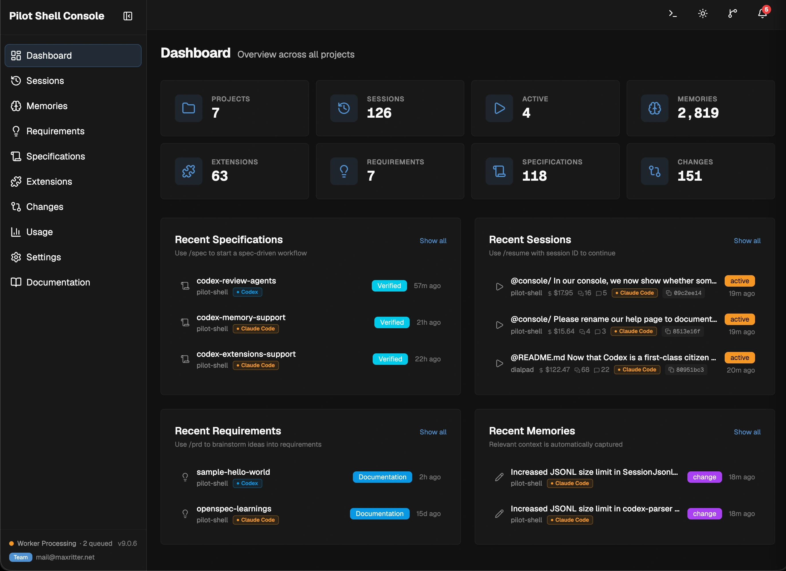

<div align="center">


### How real engineers run Claude Code and Codex

From requirement to production-grade code — planned, tested, verified.</br>
**Spec-driven plans. Enforced quality gates. Persistent knowledge.**

[](https://github.com/maxritter/pilot-shell/stargazers)
[](https://star-history.com/#maxritter/pilot-shell&Date)
[](https://github.com/maxritter/pilot-shell/releases)
[](https://github.com/maxritter/pilot-shell/pulls)

<p>
  <a href="#install">Install</a> •
  <a href="#features">Features</a> •
  <a href="https://pilot-shell.com/docs">Docs</a> •
  <a href="https://pilot-shell.com/blog">Blog</a> •
  <a href="https://pilot-shell.com">Website</a> •
  <a href="https://github.com/maxritter/pilot-shell/releases">Changelog</a>
</p>

```bash
curl -fsSL https://raw.githubusercontent.com/maxritter/pilot-shell/main/install.sh | bash
```

**macOS · Linux · Windows (WSL2)** — installs in under 2 minutes.

<br>


</div>

---

---

## Why Pilot Shell

**Claude Code and Codex CLI write code fast** — but without structure, they skip tests, lose context, and produce inconsistent results. Other frameworks add complexity (dozens of agents, thousands of lines of config) without meaningfully better output.

**Pilot Shell is different.** Every component solves a real problem with an engineered solution:

- **`/prd`** — brainstorm ideas into clear requirements with optional deep research
- **`/spec`** — plans, implements, and verifies features end-to-end with TDD
- **`/fix`** — bugfix workflow with TDD; bails out when complexity exceeds the standard fix lane
- **Spec collaboration** — share specs with teammates, annotations flow back grouped by author
- **Quality hooks** — enforce linting, formatting, type checking, and tests as quality gates
- **Context engineering** — preserves decisions and knowledge across sessions
- **Code intelligence** — semantic search (Semble) + code knowledge graph (CodeGraph)
- **Token optimization** — 60–90% cost reduction via RTK compression and Semble code search
- **Pilot Bot** — persistent automation agent with scheduled tasks and background jobs
- **Extensions** — reusable rules, skills, and MCP servers with team sharing and customization
- **Console** — local web dashboard with real-time notifications and session management

---

<h2 id="install">Getting Started</h2>

### Prerequisites

**At least one AI agent:** Pilot Shell supports **Claude Code** (primary — full feature coverage) and **Codex CLI** (all workflows, fewer platform features). Install at least one before running the Pilot installer:

- **Claude Code:** Install via the [native installer](https://code.claude.com/docs/en/quickstart). If you have the `npm` or `brew` version, uninstall it first. Requires a Claude subscription — [Max 5x or 20x](https://claude.com/pricing) for solo, [Team Premium](https://claude.com/pricing) for teams, [Enterprise](https://claude.com/pricing) for organizations.
- **Codex CLI:** Install via the [native installer](https://developers.openai.com/codex/cli). If you have the `npm` or `brew` version, uninstall it first. Requires an OpenAI subscription — [Plus or Pro](https://developers.openai.com/codex/pricing) for solo, [Business or Enterprise](https://developers.openai.com/codex/pricing) for teams.

**Terminal (Recommended):** [cmux](https://cmux.com) works great with Pilot Shell — its vertical tab layout lets you run multiple sessions side by side. Any modern terminal works: [Ghostty](https://ghostty.org/), [iTerm2](https://iterm2.com/), or the built-in macOS/Linux terminal.

### Installation

**Works with any existing project.** Pilot Shell integrates with **Claude Code** and **Codex CLI**, using their built-in concepts (rules, hooks, skills, subagents, MCP) to improve your experience:

```bash
curl -fsSL https://raw.githubusercontent.com/maxritter/pilot-shell/main/install.sh | bash
```

Installs globally on macOS, Linux, and Windows (WSL2). After installation, just run `claude` or `codex` directly — Pilot Shell is loaded automatically. Run `pilot update` to check for updates.

<details>
<summary><b>Downgrade</b></summary>

If you encounter an issue or unfixed bug in the latest version, you can always go back to a previous version (see [releases](https://github.com/maxritter/pilot-shell/releases)):

```bash
export VERSION=9.8.0
curl -fsSL https://raw.githubusercontent.com/maxritter/pilot-shell/main/install.sh | bash
```
</details>

<details>
<summary><b>Uninstalling</b></summary>

Removes the Pilot binary, plugin files, managed commands/rules, settings and shell aliases:

```bash
curl -fsSL https://raw.githubusercontent.com/maxritter/pilot-shell/main/uninstall.sh | bash
```
</details>

<details>
<summary><b>Reset & Refresh</b></summary>

Over time, accumulated session logs and Pilot Shell's caches can slow things down. A periodic reset gives you a clean baseline:

```bash
# 1. If using Claude Code, log out first
/logout

# 2. Back up your current config (just in case)
mv ~/.claude.json ~/.claude.json.bak
mv ~/.claude       ~/.claude.bak
mv ~/.codex        ~/.codex.bak
mv ~/.pilot        ~/.pilot.bak

# 3. Reinstall Pilot Shell from the official installer
curl -fsSL https://raw.githubusercontent.com/maxritter/pilot-shell/main/install.sh | bash

# 4. Re-activate your license, then start your agent
pilot activate <your-license-key>
claude   # or: codex
```

Once Pilot Shell is running smoothly again, you can delete the `.bak` copies. Forgot your license key? Recover it in the [Pilot members area](https://polar.sh/max-ritter/portal).
</details>

<details>
<summary><b>Using a Dev Container</b></summary>

Pilot Shell works inside Dev Containers. Copy the [`.devcontainer`](https://github.com/maxritter/pilot-shell/tree/main/.devcontainer) folder from this repository into your project, adapt it to your needs (base image, extensions, dependencies), and run the installer inside the container. The installer auto-detects the container environment and skips system-level dependencies like Homebrew.

For tighter isolation when working with untrusted code, combine the dev container with Claude Code's [`/sandbox`](https://code.claude.com/docs/en/sandboxing) — `bubblewrap`, `socat`, `iptables`, and `ipset` are pre-installed in the Dockerfile so it works out of the box on Linux. See Anthropic's [development containers](https://code.claude.com/docs/en/devcontainer) and [sandboxing](https://code.claude.com/docs/en/sandboxing) docs for hardening patterns (egress allowlist, managed settings, persistent volumes).

</details>

<details>
<summary><b>What the installer does</b></summary>

8-step installer with progress tracking, rollback on failure, and idempotent re-runs. Steps 3 and 4 are agent-conditional — they skip cleanly when the matching agent CLI is not detected. The installer **does not install Claude Code or Codex CLI itself**; install at least one yourself per the prerequisites above.

1. **Prerequisites** — Checks/installs Homebrew, Node.js, Python 3.12+, uv, git, jq. Verifies at least one supported agent (Claude Code or Codex CLI) is on the system; aborts with a clear error otherwise.
2. **Pilot files** — Agent-neutral Pilot Shell-managed assets. Hooks → `~/.pilot/hooks/`, Console scripts/UI → `~/.pilot/`, MCP server template → `~/.pilot/.mcp.json`, raw rule sources → `~/.pilot/rules/` (read by Codex's adapter), plus the canonical skill source at `~/.claude/skills/` (Claude reads natively; Codex adapts in step 4). Always runs.
3. **Claude files** — Claude-specific assets under `~/.claude/`: rules, sub-agents, `settings.json` (three-way merged), plus the Claude post-install merges (hooks into settings, `~/.claude.json` MCP block, model config migration). **Skipped when Claude Code CLI is not detected.**
4. **Codex files** — Codex-specific assets: adapted skills → `~/.agents/skills/`, review agents → `~/.codex/agents/`, `~/.codex/AGENTS.md`, `~/.codex/config.toml`, `~/.codex/hooks.json`. Per-category counts mirror the Claude section. **Skipped when Codex CLI is not detected.**
5. **Config files** — Creates `.nvmrc` and project config.
6. **Dependencies** — Installs Semble, RTK, CodeGraph, [Chrome DevTools MCP](https://github.com/ChromeDevTools/chrome-devtools-mcp), [playwright-cli](https://github.com/microsoft/playwright-cli), [agent-browser](https://agent-browser.dev/), language servers, and the `codex@openai-codex` Claude marketplace plugin (skipped on Codex-only systems alongside Chrome DevTools MCP and LSP plugins).
7. **Shell integration** — Auto-configures bash, fish, and zsh with the `pilot` admin alias.
8. **Finalize** — Success message with next steps.

</details>

### First Steps

Run these commands once in each new project after installing Pilot Shell:

```bash
# Claude Code         # Codex CLI
claude                codex
> /setup-rules        > $setup-rules
```

`/setup-rules` reads your codebase, discovers your conventions, and generates project-specific rules and MCP server docs — this is how Pilot learns your project. Run it once to start, then again after major architectural changes.

Once your rules are in place, use `/create-skill` to capture any repeatable workflow as a reusable skill, and `/benchmark` to measure whether your rules and skills are actually improving outputs. See [Additional Workflows](#additional-workflows) for full details on all three.

---


<h2 id="features">Core Workflows</h2>

Three commands cover the full development cycle — from vague idea to shipped feature. Quality hooks and TDD enforcement run automatically on every task.

### /prd — Brainstorm Ideas Into Product Requirements Documents

[`/prd`](https://pilot-shell.com/docs/workflows/prd) is the brainstorming surface for ideas that aren't specs yet — vague problem statements and fuzzy shapes. It pitches directions, pressure-tests them with you, and converges on a PRD you can hand to `/spec`. PRDs are saved to `docs/prd/` and visible in the Console's **Requirements** tab.

```bash
# Claude Code                                                  # Codex CLI
claude                                                          codex
> /prd "Add real-time notifications for team updates"           > $prd "Add real-time notifications for team updates"
```

<details>
<summary><b>How <code>/prd</code> works</b></summary>

**When to use `/prd` over `/spec`:** `/prd` is for **what** and **why**; `/spec` is for **how**. Reach for `/prd` first when you only have a problem statement, want to riff across multiple directions, or need scope boundaries defined before someone starts building.

**Flow:** two modes, picked automatically from how fuzzy the idea is:

1. **Ideate** — free-form prose, the agent pitches 3-5 directions, you react (only runs when the idea is vague)
2. **Clarify → Converge → Write** — structured multiple-choice questions once the shape is known, then the PRD is written

**Research tiers** (picked at the start):

| Tier | Behavior |
|------|----------|
| **Quick** | Skip research |
| **Standard** | Light in-session web search for competitors, prior art, best practices |
| **Deep** | Hands off to the dedicated **`deep-research`** skill — multi-angle search, source verification, and a cited report (Codex uses an in-session multi-angle pass) |

The final PRD covers problem statement, core user flows, scope boundaries, and technical context — then offers to hand off directly to `/spec` for implementation.

</details>

### /spec — Spec-Driven Development

[`/spec`](https://pilot-shell.com/docs/workflows/spec) is for new features, refactoring, and architectural work. It provides a complete planning workflow with TDD, verification, and code review (on Claude Code, it replaces the built-in plan mode at Shift+Tab). **[Collaborative spec review](https://pilot-shell.com/docs/features/spec-collaboration) shifts review left** — share a single link, teammates annotate inline, feedback flows back into the Console grouped by author.

```bash
# Claude Code                                        # Codex CLI
claude                                                codex
> /spec "Add user authentication with OAuth and JWT"  > $spec "Add user authentication with OAuth and JWT"
```

```
Discuss  →  Plan  →  Approve  →  Implement (TDD)  →  Verify  →  Done
                                                        ↑         ↓
                                                        └── Loop──┘
```

<details>
<summary><b>How <code>/spec</code> works</b></summary>

`/spec` auto-detects whether the request is a feature or a bugfix and routes to the right workflow. The three phases below apply to both — the verify step differs slightly (features get E2E scenarios; bugfixes get a Behavior Contract audit, see the `/fix` section below).

**Plan:** Explores codebase with semantic search → asks clarifying questions → writes detailed spec with scope, tasks, and definition of done → for UI features, writes **E2E test scenarios** (step-by-step, browser-executable) that become the verification contract → **spec-review sub-agent** validates completeness in Claude Code or Codex → waits for your approval. Optional **Codex Companion Reviewers** provide a Claude Code plugin second opinion when enabled.

**Implement:** Creates an isolated git worktree → implements each task with strict TDD (RED → GREEN → REFACTOR) → quality hooks auto-lint, format, and type-check every edit → full test suite after each task.

**Verify:** Full test suite + actual program execution → **changes review** (mechanism per the Console's Changes Review Mode setting in Claude Code — a single changes-review sub-agent by default for the lowest token cost, or the built-in `/code-review` skill at medium/high/xhigh — plus an inline plan-compliance & goal-truth audit; native changes-review agent in Codex) → for UI features, executes each E2E scenario step-by-step via browser automation (pass/fail tracked, results written to plan) → auto-fixes findings → squash merges to main on success.

**Model:** With [Model Switching](https://pilot-shell.com/docs/features/model-routing) on (default), planning runs on **Opus** and implementation + verification on **Sonnet**, automatically — no manual `/model` step. `/spec` checks your model first and blocks with a reminder to run `/model opusplan` if you're on the wrong one (it requires Opus when Model Switching is off). On **Claude Fable 5** (`/model fable`) the whole workflow runs single-model — there is no `fableplan` — and Pilot preserves your saved Fable model instead of overwriting it.

</details>

### /fix — Bugfix Workflow

**[`/fix`](https://pilot-shell.com/docs/workflows/fix) is the bugfix command.** Investigate the bug, write the failing test, fix at the root cause, single-pass audit, done. No plan file, no approval mid-flow, no separate verify phase.

```bash
# Claude Code                                                        # Codex CLI
claude                                                                codex
> /fix "annotation persistence drops fields between save and reload"  > $fix "annotation persistence drops fields"
```

```text
Investigate  →  RED  →  Fix  →  Audit  →  Quality Gate  →  Done
```

If investigation reveals the bug is multi-component or architectural, `/fix` stops cleanly and tells you to re-invoke with `/spec`. `/fix` is always quick; `/spec` is the full workflow.

<details>
<summary><b>How <code>/fix</code> works</b></summary>

For local bugs. Single file, obvious-once-traced root cause. No plan file, no approval mid-flow, no separate verify phase. TDD still enforced — bugfixes without a failing test don't ship.

- **Investigate:** Reproduce the bug → trace to root cause at `file:line` with `codegraph_context` (structure) + `semble search` (intent, cross-language) + targeted reads → state confidence (High/Medium required to proceed). For UI / async / race bugs, add temporary `SPEC-DEBUG:`-marked logs at component boundaries before tracing.
- **RED:** Write the failing test via an existing public entry point → run, must fail with the documented symptom.
- **Fix:** Minimal change at the root cause. Symptom patches are forbidden. Reproducing test must pass, then the targeted test module. Diff sanity check (root-cause file in diff, no unplanned files, < 20 lines, symptom-patching grep) catches issues with the fix itself.
- **Verify End-to-End:** The primary correctness signal. Run the actual program with the original input (browser automation for UI — Claude Code uses its Chrome extension; Codex uses Chrome DevTools MCP; both fall back to playwright-cli / agent-browser. CLI / API / REPL / job trigger for non-UI) and capture concrete evidence. A passing unit test alone is never accepted as proof.
- **Quality Gate:** Lint + types + build + full anti-regression suite, once.
- **Review (when enabled):** Honours the same Console Settings as `/spec` — with **Changes Review** (on by default) or **Codex Companion Changes Review** enabled, those reviewers audit the fix at finalise and findings are auto-fixed before the approval gate.

**When to use `/spec` for bugs instead:** bugs that span 3+ files, need a written plan and approval, warrant a Behavior Contract (`Given / When / Currently / Expected`), or have failed two fix attempts. `/spec` adds a revert-test proof in verify, a cap at 3 iterations, and a code review gate — use it when the complexity makes that structure worthwhile.

</details>

---

## Additional Workflows

Run after installing Pilot Shell to configure your environment, then on demand as your project evolves.

### /setup-rules — Generate Modular Rules

[`/setup-rules`](https://pilot-shell.com/docs/workflows/setup-rules) explores your codebase, discovers conventions, generates modular rules and documents MCP servers. Run once initially, then anytime your project changes significantly.

```bash
# Claude Code         # Codex CLI
claude                codex
> /setup-rules        > $setup-rules
```

<details>
<summary><b>How <code>/setup-rules</code> works</b></summary>

12 phases that read your codebase and produce comprehensive AI context:

0. **Reference** — load best practices for rule structure, path-scoping, and quality standards
1. **Read existing rules** — inventory all `.claude/rules/` files, detect structure and path-scoping. Also detects `CLAUDE.md` and `AGENTS.md` (the cross-framework agent context file used by Codex, Cursor, etc.)
2. **Migrate unscoped assets** — prefix with project slug for better sharing
3. **Quality audit** — check rules against best practices (size, specificity, stale references, conflicts)
4. **Explore codebase** — hybrid semantic+lexical search with Semble, structural analysis with CodeGraph
5. **Compare patterns** — discovered vs documented conventions
6. **Sync project rule** — update `{slug}-project.md` with current tech stack, structure, commands. Migrates `CLAUDE.md` / `AGENTS.md` content into modular rules
7. **Sync MCP docs** — smoke-test user MCP servers, document working tools
8. **Discover new rules** — find undocumented patterns worth capturing
9. **Cross-check** — validate all references, ensure consistency across generated files
10. **Sync AGENTS.md** — if `AGENTS.md` already exists, offer to re-export the updated rules into it so non-Claude agents see the same context. Always asks first, never creates the file if absent, preserves user-authored sections
11. **Summary** — report all changes made

**For monorepos:** Organizes rules in nested subdirectories by product and team, with `paths` frontmatter to scope rules to specific file types. Generates a `README.md` documenting the structure.

</details>

### /create-skill — Reusable Skill Creator

[`/create-skill`](https://pilot-shell.com/docs/workflows/create-skill) builds a reusable skill from any topic — explores the codebase and creates it interactively with you. If no topic is given, evaluates the current session for extractable knowledge.

```bash
# Claude Code                                              # Codex CLI
claude                                                      codex
> /create-skill "Automate PR Bot comment review"           > $create-skill "Automate PR Bot comment review"
```

<details>
<summary><b>How <code>/create-skill</code> works</b></summary>

6 phases that turn domain knowledge into a reusable skill:

1. **Reference** — load use case categories, complexity spectrum, file structure template, description formula, security restrictions
2. **Understand** — explore the codebase for relevant patterns, ask clarifying questions, or evaluate the current session for extractable knowledge
3. **Check existing** — search project and global skills to avoid duplicates
4. **Create** — write to the active agent's skills directory (`.claude/skills/` or `~/.claude/skills/` for Claude Code; `~/.agents/skills/` for Codex), apply portability and determinism checklists
5. **Quality gates** — structure checklist (SKILL.md naming, frontmatter fields), content checklist (error handling, examples, exclusions), triggering test (should/shouldn't trigger), iteration signals
6. **Test & iterate** — run test prompts with sub-agents, evaluate results, optimize description triggering

**Use case categories:**

| Category                      | Best For                                                                   |
| ----------------------------- | -------------------------------------------------------------------------- |
| **Document & Asset Creation** | Consistent reports, designs, code with embedded style guides and templates |
| **Workflow Automation**       | Multi-step processes with validation gates and iterative refinement        |
| **MCP Enhancement**           | Workflow guidance on top of MCP tool access, multi-MCP coordination        |

**Skill structure:** Each skill is a folder with a `SKILL.md` file (case-sensitive), optional `scripts/`, `references/`, and `assets/` directories. The YAML frontmatter description determines when the agent loads the skill — it must include what the skill does, when to use it, and specific trigger phrases. Progressive disclosure keeps context lean: frontmatter loads always (~100 tokens), SKILL.md loads on activation, linked files load on demand.

</details>

### /benchmark — Measure Rule & Skill Impact

[`/benchmark`](https://pilot-shell.com/docs/workflows/benchmark) runs your prompts with and without the target, grades outputs against falsifiable assertions, and shows a structured report you can absorb in 30 seconds — labeled verdict, quadrant breakdown, and only the divergent assertions in the drill-down. Finishes with a concrete improvement plan so you know exactly what to change next.

```bash
# Claude Code                              # Codex CLI
claude                                      codex
> /benchmark pilot/skills/create-skill     > $benchmark pilot/skills/create-skill
> /benchmark pilot/rules/testing.md        > $benchmark pilot/rules/testing.md
```

<details>
<summary><b>How <code>/benchmark</code> works</b></summary>

Six phases turn a rule or skill into a before/after comparison with an actionable plan:

1. **Intake** — pick up an existing `benchmarks/<target>/evals.json` or author one
2. **Target discovery** — classify as `skill` or `rules`
3. **Author evals** — draft 3 falsifiable assertions; falsifiability gate ensures baseline actually fails
4. **Execute** — run both configs in isolated sandboxes; grader subagent scores every assertion
5. **Present findings** — three layers, scannable top-to-bottom:

   | Layer | Content |
   |---|---|
   | **Verdict** | One labeled sentence with a recommended next step. Delta bands: 🟢 Strong (≥ +0.50) / 🟢 Moderate (+0.20) / 🟡 Weak (+0.05) / ⚪ Indistinguishable (±0.05) / 🔴 Regression (< −0.05) |
   | **Quadrant breakdown** | Counts each assertion as Signal (✓/✗) / Baseline (✓/✓) / Unreachable (✗/✗) / Regression (✗/✓). The dominant quadrant drives the plan |
   | **Per-eval drill-down** | Only divergent assertions get a row; matching ones fold into header counts so the report stays under one screen |

6. **Improvement plan** — ≤ 5 ranked proposals in a uniform format (`[TARGET]` or `[EVALS]` tag, location, current quote, replacement, "Lever" line). You pick: apply target edits, iterate on evals, both, or save the plan and stop. Re-runs land in a fresh `runs/<ts>/` so iteration deltas stay legible.

**Isolation:** each run gets its own sandbox directory; a globally-installed copy of the target in `~/.claude/` (or `~/.codex/` / `~/.agents/`) is auto-hidden for the duration and restored afterward (with on-disk recovery manifest covering SIGKILL / power loss / segfault). Conditional-loading frontmatter (`path:` / `paths:`) is stripped from the copy installed into the `with` sandbox so the target loads unconditionally for every prompt — without that, rules scoped to e.g. `paths: ["**/*.py"]` would stay dormant in both configs and the delta would collapse to 0.00. The source file is never modified.

**Key flags:** `--runs N` (default 1), `--configs with,without`, `--workers N`, `--model`, `--no-isolate-global`, `--restore-hidden`.

</details>

## Pilot Shell Console

Local web dashboard at `localhost:41777` with real-time notifications and 10 views.



### Dashboard

Global command center with 8 clickable stat cards and 4 recent cards (Specifications, Requirements, Sessions, Memories). Active specs shown as pills in the top bar; notification bell in the top right.

### Sessions

Browse past sessions with search for both Claude Code and Codex. For Claude Code, copy the session ID and use `/resume <session-id>` to directly jump back into any session.

### Memories

Browsable observations — decisions, discoveries, bugfixes — with type filters and search. Each memory shows its session — click to navigate directly to it.

### Requirements

Product requirement documents (PRDs) generated by `/prd`, with view and annotate modes. Access all previous documents and share them with your team for direct feedback and annotations.

### Specifications

All spec plans generated by `/spec` with task progress, phase tracking, and iteration history. Annotate mode lets you mark up plans visually before approving, share with teammates via a single link.

### Extensions

Browse, edit, compare, and share your rules, commands, skills, and agents. Connect a git remote to push/pull extensions across your team, with optional APM-compatible export format.

### Changes

Git diff viewer with staged/unstaged files, branch info, and worktree context. Review mode adds inline annotations on diff lines — the agent reads them directly before marking a spec as verified.

### Usage

Daily token costs, model routing breakdown, and usage trends across sessions for both Claude Code and Codex sessions. Correlates costs to commits and show savings via CLI proxy integration.

### Settings

Configure spec workflow toggles, reviewer settings, and Console preferences. Toggle labels show which review agents run on Claude Code + Codex, and which Codex Companion Reviewers require the Claude Code Codex plugin.

### Documentation

Documentation, guides, and quick-start resources to explain the concepts in detail.

---

## Documentation

For full details on every component, see the **[Documentation](https://pilot-shell.com/docs/)**.

---

## Changelog

See the full changelog at [GitHub Releases](https://github.com/maxritter/pilot-shell/releases).

---

## Contributing

Found a bug or missing a feature? [Open an issue](https://github.com/maxritter/pilot-shell/issues) on GitHub.

---

## License

See [LICENSE](LICENSE).

---

<div align="center">

**How real engineers run Claude Code and Codex**

</div>
